 
## 查看主页获取源码

> **作者介绍**： **✌**全网粉丝10W+本平台特邀作者、博客专家、CSDN新星计划导师、java领域优质创作者,博客之星、掘金/华为云/阿里云/InfoQ等平台优质作者、专注于毕业项目实战 **✌**

  

### 一、作品包含

源码+数据库+设计文档万字+全套环境和工具资源+部署教程

### 二、项目技术

前端技术：Html、Css、Js、Bootstrap

数据库：MySQL

后端技术：Java、Spring Boot、MyBatis

### 三、运行环境

开发工具：IDEA

数据库：MySQL8.0

数据库管理工具：Navicat10以上版本

环境配置软件： JDK1.8+Maven3.6.3
  

### 四、项目介绍
项目编号：springbootA042

用户和管理员功能模块
（1）登录：管理员能够根据账号访问系统。
（2）用户管理：管理员可以添加、删除、修改用户信息，查看用户列表，对用户进行管理和控制。例如，管理员可以查看每个用户的个人信息、交易记录等，并可以对用户的交易行为进行审核和管理。
（3）公益项目管理：管理员可以添加、删除、修改慈善项目信息，查看慈善项目列表，对物品进行管理和控制。例如，管理员可以查看每个慈善项目的详细信息、交易记录等，并可以对慈善项目的交易情况进行审核和管理。
（4）捐赠管理：管理员可以查看交易信息，对交易进行管理和控制。例如，管理员可以查看每笔交易的详细信息，包括交易物品、交易时间、交易金额等，并可以对交易进行审核和管理。
（5）志愿者管理：对志愿者真实名字手机号技能年龄住址性别进行增删改查，管理和控制志愿者信息。
（6）新闻管理：对新闻作者，标题，发布时间增删改查，显示在前端用户端列表。
（8）退出模块：管理员可以在使用完系统后，进行系统退出操作，用于保证系统的安全性，避免自己不在的时候，别人登录系统

### 五、运行截图

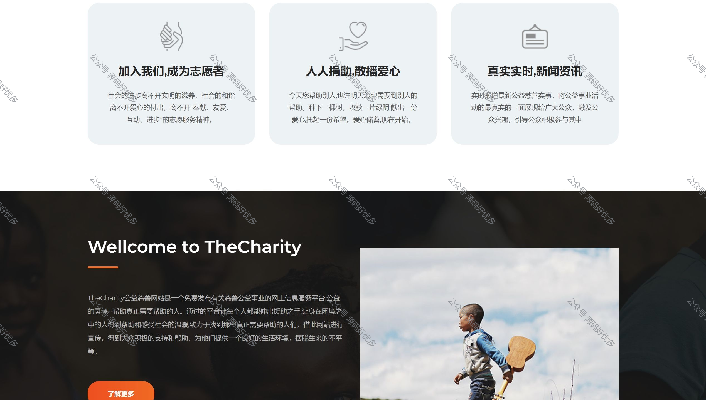
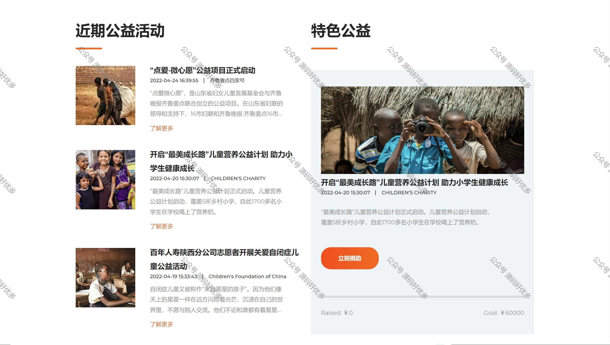
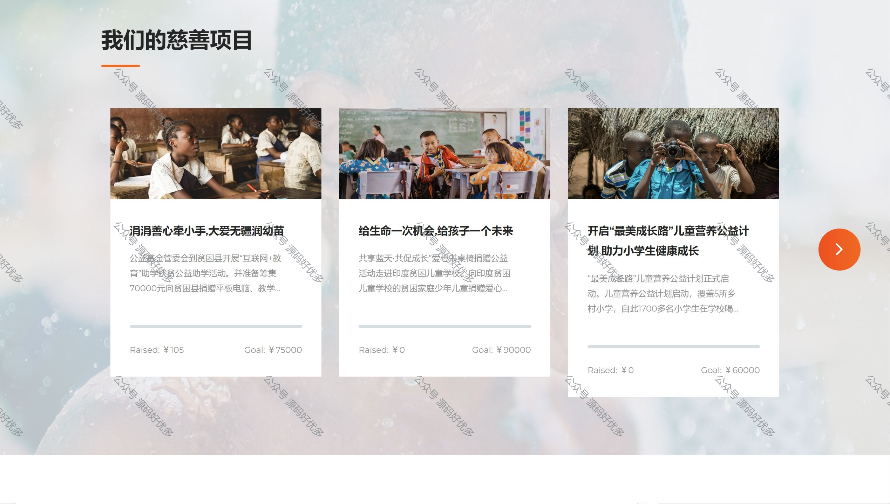
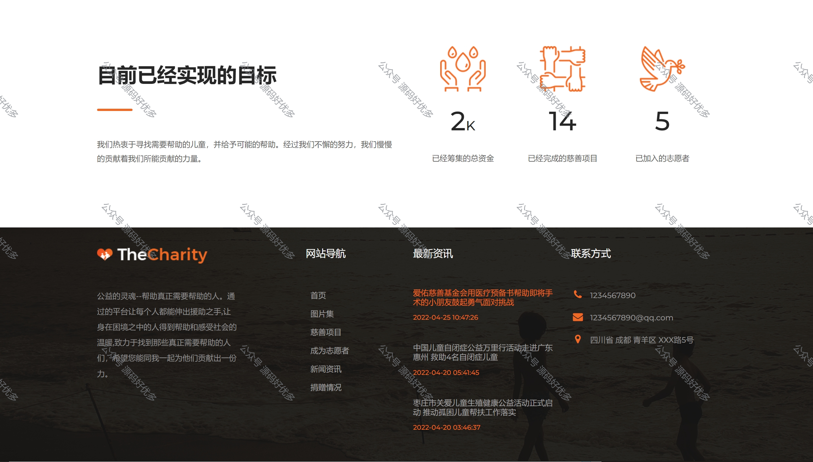
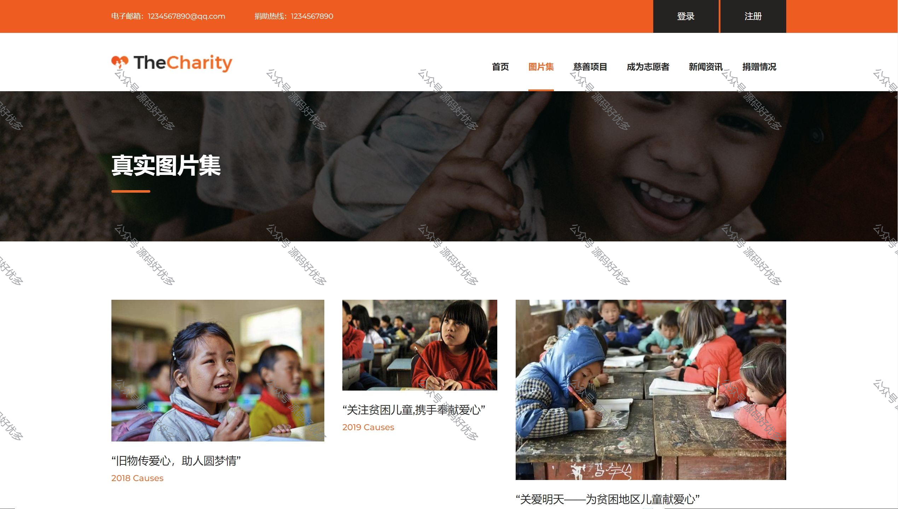
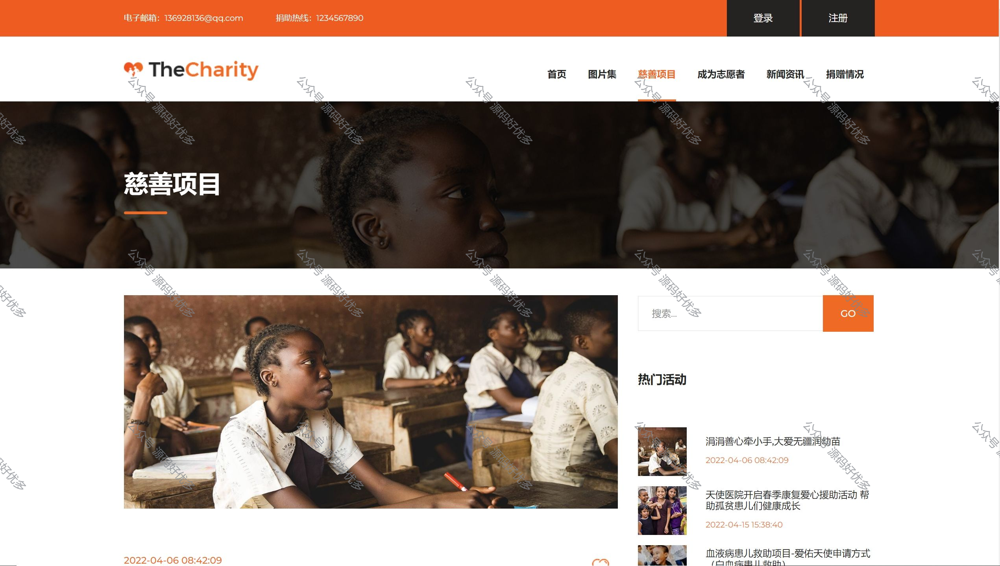
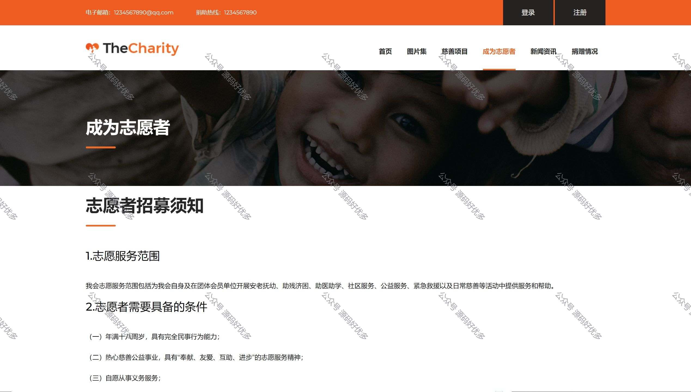
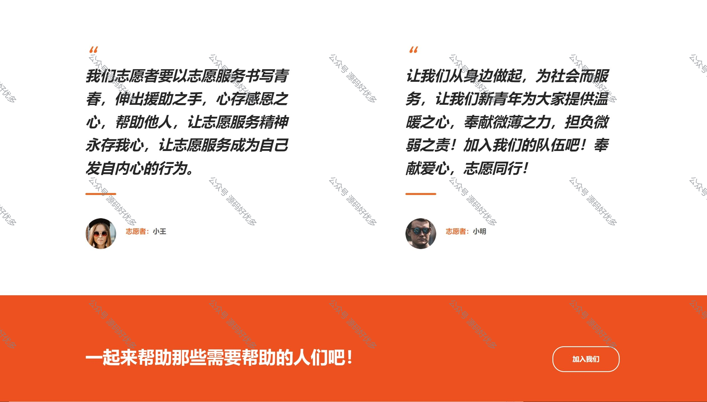
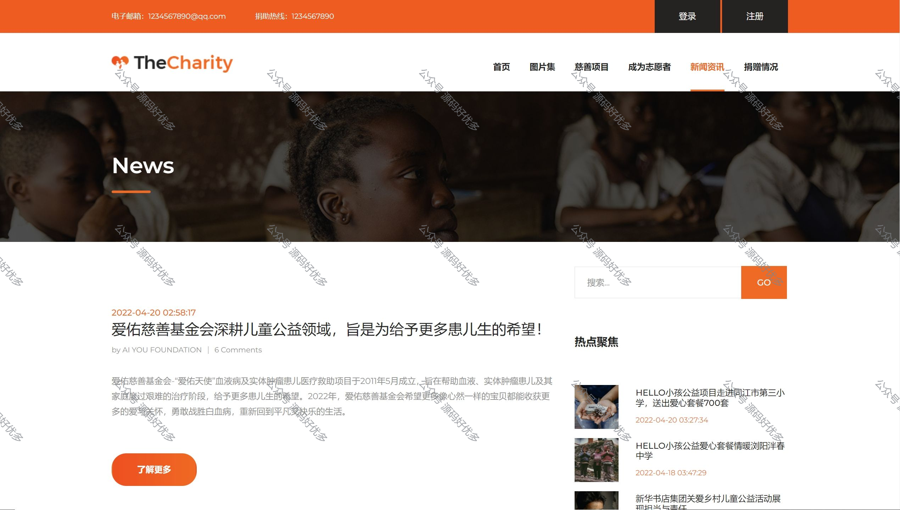
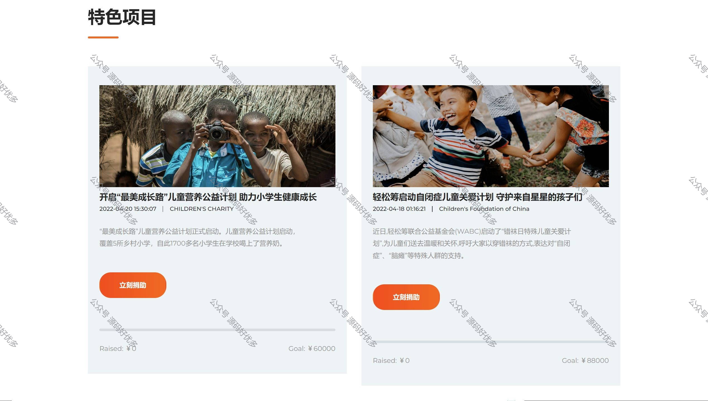
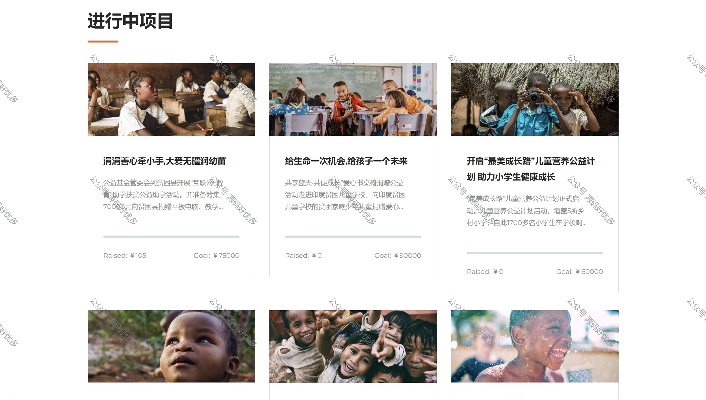
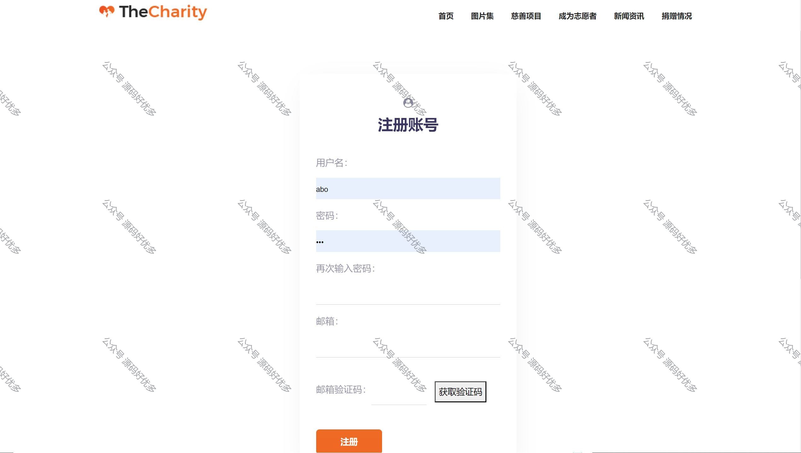
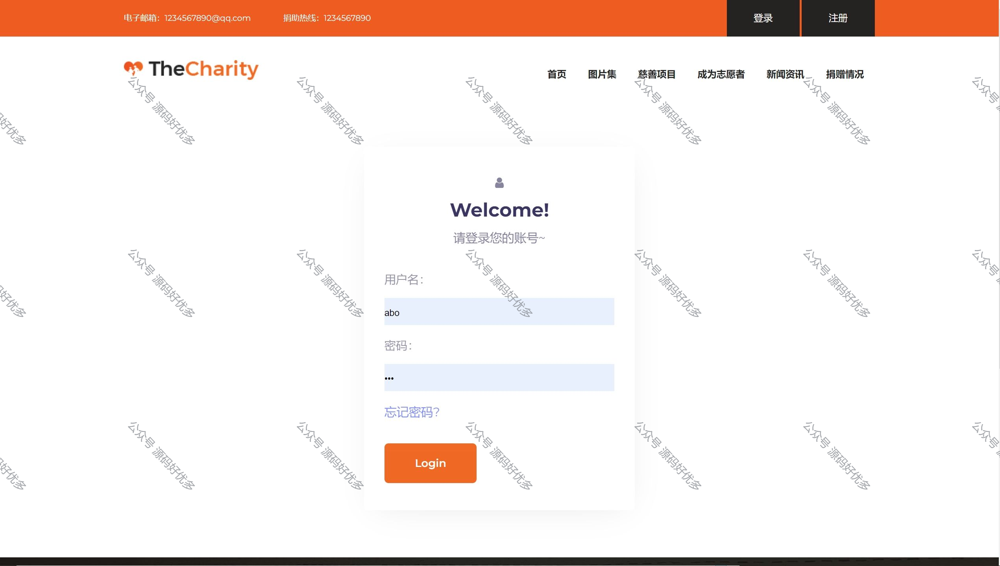
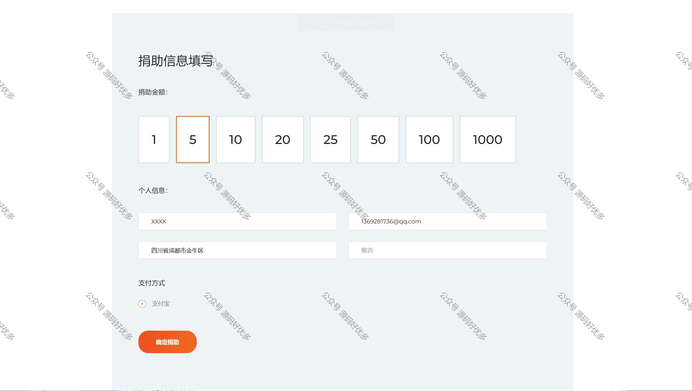

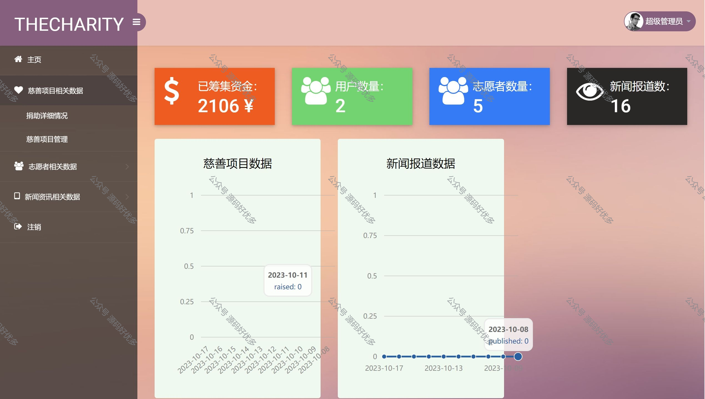
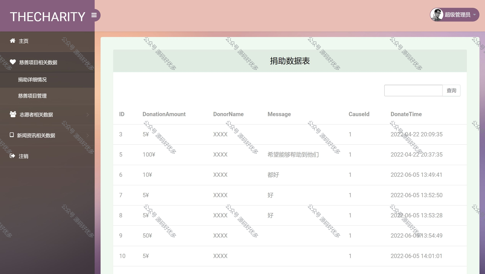
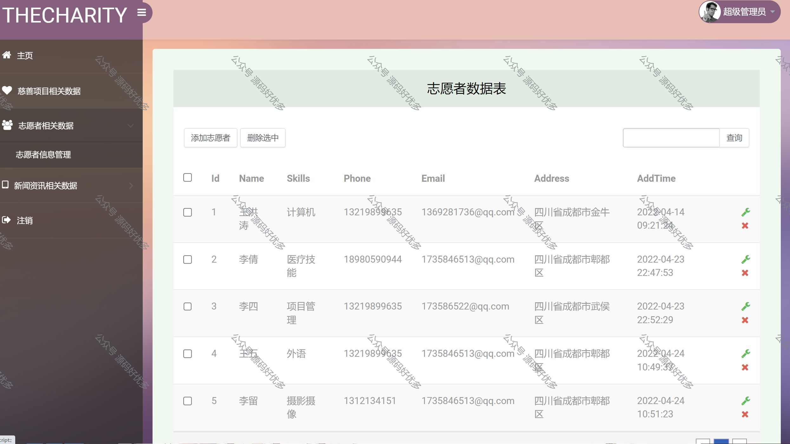
